

  

# MoshiMoshi

A workload and well-being companion for university students, submitted by **4AGI** for **CodeNection 2026**.

| Submission detail | Information |
| --- | --- |
| Track | Track 1 — Lifestyle & Personal Productivity |
| Problem statement | Stress & Workload Manager |
| Team | Loh Jinsen, Sim Shi Zhen, Chia Zi Qi, Ng Joey |
| Phase | UI/UX prototype submission |

## Submission links

| Material | Link |
| --- | --- |
| Full submission document | [MoshiMoshi — 4AGI](docs/4AGI.docx) |
| Google Docs presentation material | [Open the shared document](https://docs.google.com/document/d/1XTeTMmBsbtqildiGJjfUoeVCdnfJg-UFxQdWZud-LKc/edit?usp=sharing) |
| Presentation slides | [View slides on Canva](https://canva.link/evvrrgeeuauiilh) |
| Interactive UI prototype | [Explore MoshiMoshi in Figma](https://www.figma.com/proto/vAz2Dtc4Xle1BFnbD1YdZM/MoshiMoshi?node-id=2240-2866&scaling=scale-down&content-scaling=fixed&page-id=2005%3A5&starting-point-node-id=2284%3A347&show-proto-sidebar=1) |
| Design board | [View the Figma screens](https://www.figma.com/design/vAz2Dtc4Xle1BFnbD1YdZM/Assignment?node-id=2005-5) |
| Video presentation | [Watch the MoshiMoshi presentation on YouTube](https://youtu.be/l27FOCsOmew) |

The full submission document contains the detailed proposal, ideation materials, mentor feedback, prototype screenshots, and proposed technical plan. This submission presents the UI/UX and planned solution; the implementation described below is proposed work for the finalist phase.

## 1. Project overview

### The problem

University students juggling assignments, classes, group meetings, part-time work, and personal errands can become overloaded across several areas at once. A busy calendar does not explain emotional pressure, missed rest, or a lack of social support. Repeated manual logging also becomes harder when a student is already tired.

Our initial target is university students managing overlapping academic deadlines and personal commitments. The proposal considers Todoist, Headspace, and Finch as reference points for task organization, recovery, and companion-based self-care. MoshiMoshi focuses on connecting these needs in one student workflow: understand the load, adjust the plan, and take a suitable recovery action.

### Our solution

MoshiMoshi is a proposed AI companion that brings tasks, schedules, and student-provided well-being information into a five-dimensional load overview. It helps students decide what they must do, should do, and can safely defer, with confirmation before changing their plan. It then suggests recovery activities that fit the time available. Healthy actions earn points and help the Moshi companion grow.

### Core features

- **Five-dimensional load overview:** Mental, Time, Physical, Social, and Errands, so students can see which area needs attention.
- **Task rebalancing:** suggested priorities and schedule changes that students can accept or reject.
- **Flexible task collection:** manual entry, voice, timetable and assignment uploads, and proposed calendar integration.
- **Talk to Moshi:** conversational planning and emotional check-ins in the same interaction.
- **Recovery activities:** breathing, stretching, naps, walks, relaxing audio, and sleep preparation, with durations shown.
- **Companion growth and rewards:** points and shop items tied to recovery and healthier habits as well as tasks.
- **Community and nearby activities:** groups, friends, and location-aware errand planning as broader concept features.
- **Privacy-conscious processing:** a proposed local-first approach for sensitive context, with permission and manual alternatives.

### Intended impact

Before MoshiMoshi, a student with an assignment due tomorrow, a meeting tonight, and unfinished laundry must work out the overload and the next step alone. With MoshiMoshi, the intended flow is to identify the affected load dimensions, protect the urgent assignment, defer a flexible task with permission, and fit in a short recovery break. This is the intended benefit to validate through a student pilot, rather than a measured outcome.

## 2. Ideation and process

### Ideas we considered

| Idea | Why we kept or dropped it |
| --- | --- |
| Five-dimensional workload overview — kept | Shows the causes of overload across academic and personal life. |
| Proactive AI support — kept | Aims to reduce repeated logging when students are already overwhelmed. |
| Conversational AI companion — kept | Makes planning and check-ins feel more approachable. |
| AI task rebalancing — kept | Turns a warning into a practical change the student can approve. |
| Privacy-conscious edge processing — kept | Keeps sensitive context close to the student. |
| Calendar and meeting integration — kept | Brings classes and group commitments into the daily plan. |
| Timetable and assignment uploads — kept | Reduces re-entry of academic requirements stored in documents. |
| Voice capture — kept | Offers an alternative when typing feels burdensome. |
| Context-appropriate recovery — kept | Fits a recovery action to the time and energy available. |
| Guided breathing mini-game — kept | Makes a short break structured and achievable. |
| Points, shop, and character growth — kept | Connects healthy habits to companion progress. |
| Location-aware planning — kept | Accounts for travel and practical errands. |
| Student community — kept | Supports encouragement and accountability. |
| Fully manual task and mood logging — dropped as the main approach | Adds friction during overload; retained as a fallback. |
| Fixed timetable reminders — dropped as the main approach | Can arrive at unsuitable moments when the actual day changes. |
| Single overall stress score — dropped | Does not explain the source of overload or the next action. |
| Long meditation sessions as the main recovery method — dropped | Can be difficult to fit between classes and deadlines. |
| Going out as the default recovery action — dropped | May require more time or energy than the student has. |
| Rewards based only on task completion — dropped | Could encourage overwork instead of balance. |

### Ideation boards

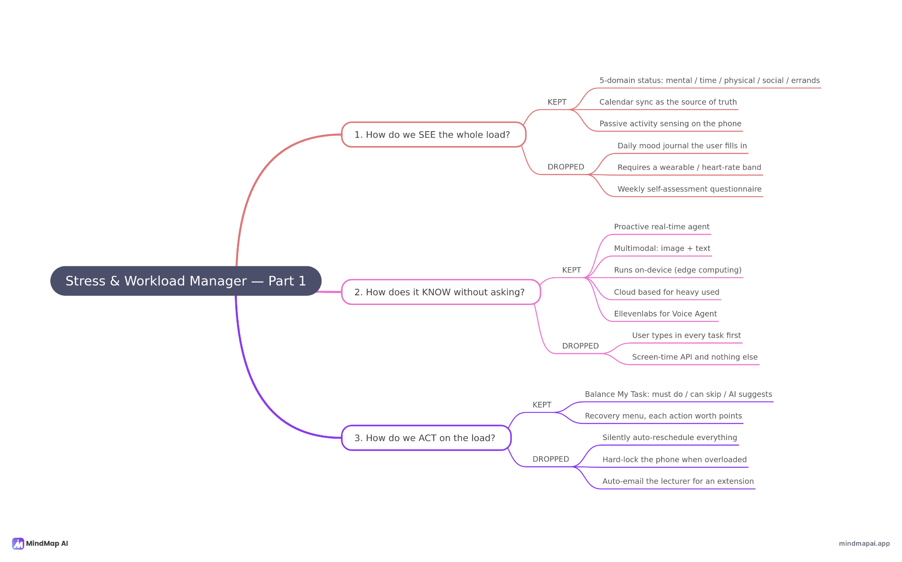

The first board maps how we understand and act on workload, including approaches we kept and dropped.

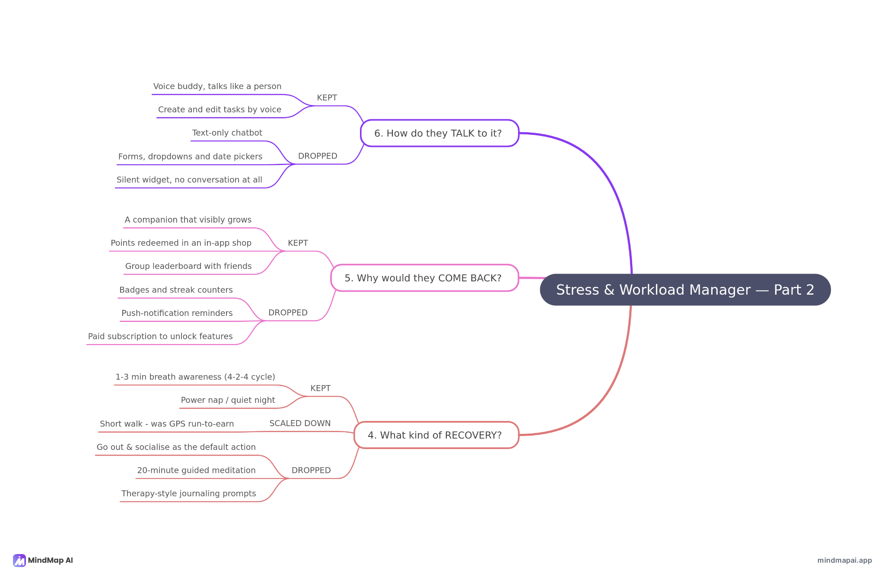

The second board explores recovery, reasons to return, and interaction methods, including ideas dropped or reduced in scope.

### Mentor consultation

| Date | Mentor | Feedback received | Design change |
| --- | --- | --- | --- |
| 10 September 2026 | Kueh Pang Teng | Sending captured screen images to cloud AI could expose assignments, private messages, and personal files. | Revised the proposed architecture toward on-device analysis of sensitive context, with only limited derived information considered for cloud processing. |

This feedback shifted privacy into the architecture. The precise sensing method and on-device model capability still require validation during implementation.

## 3. Design and prototype

[Open the interactive Figma prototype](https://www.figma.com/proto/vAz2Dtc4Xle1BFnbD1YdZM/MoshiMoshi?node-id=2240-2866&scaling=scale-down&content-scaling=fixed&page-id=2005%3A5&starting-point-node-id=2284%3A347&show-proto-sidebar=1). Screenshots and descriptions are included in **Section 3** of the [submission document](docs/4AGI.docx).

| Screen | Main interaction |
| --- | --- |
| Home | Meet the companion, view today's status, and access Task, Voice, Recovery, and Community. |
| Profile and shop | View level, points, and progress, then browse companion items. |
| Today's Status and task balancing | Inspect all five load dimensions and review changes to an overloaded plan. |
| Task | Review the daily schedule and deadlines; add or edit responsibilities. |
| Voice | Discuss plans or feelings with the companion and review suggested actions. |
| Recovery | Choose a suitable break and follow a guided activity such as breathing. |
| Community | Explore groups and friends for support and accountability. |

**Core walkthrough:** Home → Today's Status → task balancing → revised plan → Recovery → guided breathing → points and companion progress.

### Prototype screenshots

#### Home

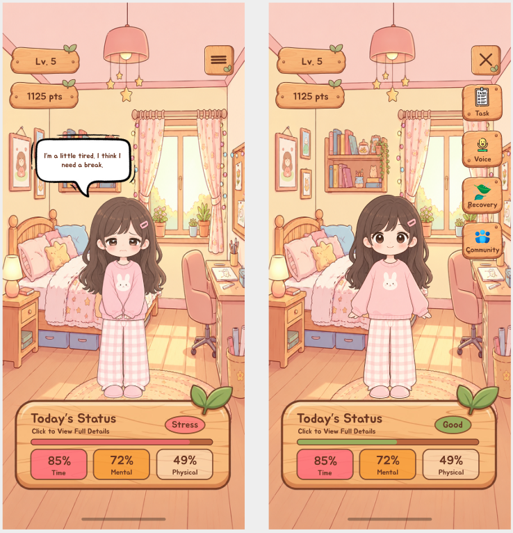

The home screen brings the companion, daily status, and main navigation together.

#### Profile and shop

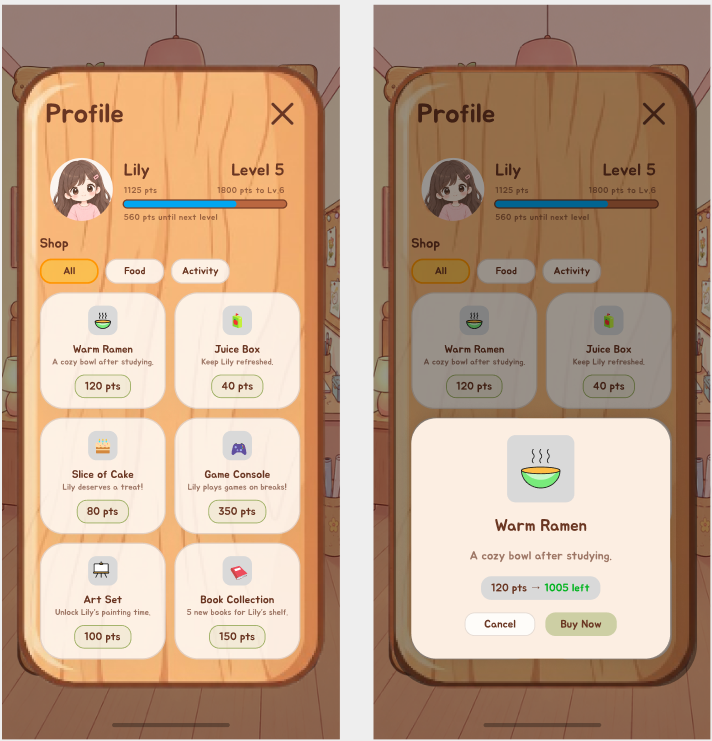

Students view companion progress and exchange earned points for items.

#### Today's Status and task balancing

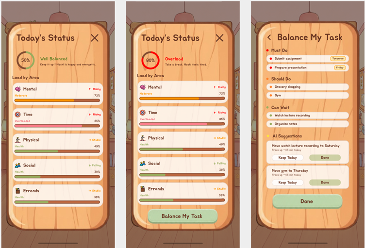

Students inspect their load and review suggested changes when the day becomes overloaded.

#### Tasks

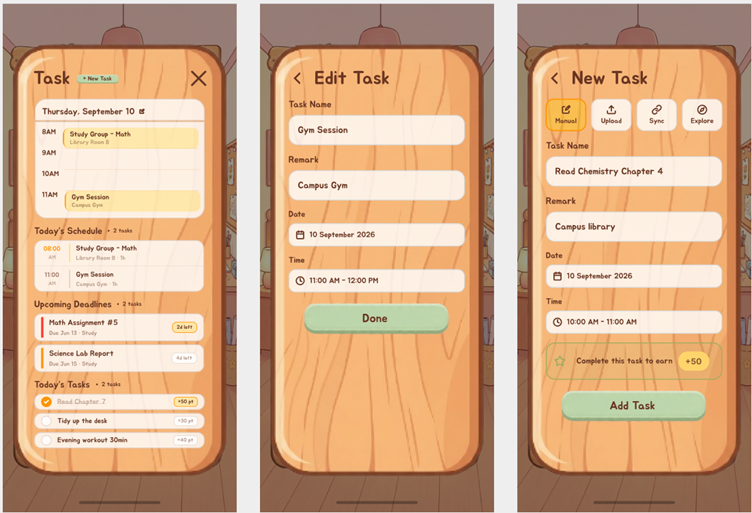

The task flow covers the daily schedule, deadlines, and ways to add or update responsibilities.

#### Voice companion

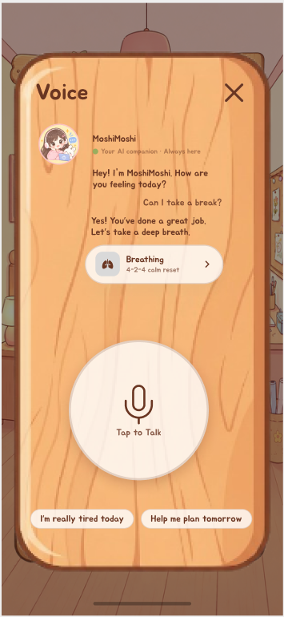

Voice interactions offer another way to discuss plans, share feelings, and request help.

#### Recovery

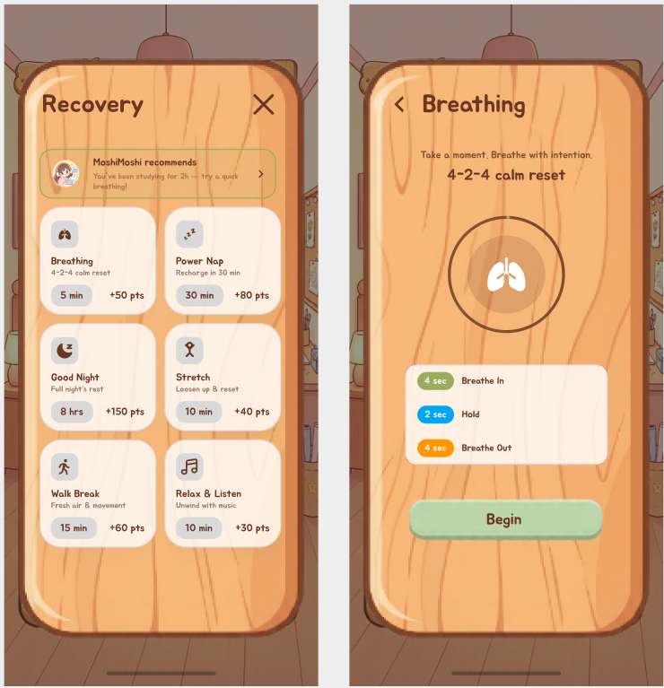

Students choose a suitable break, follow the activity, and receive points on completion.

#### Community

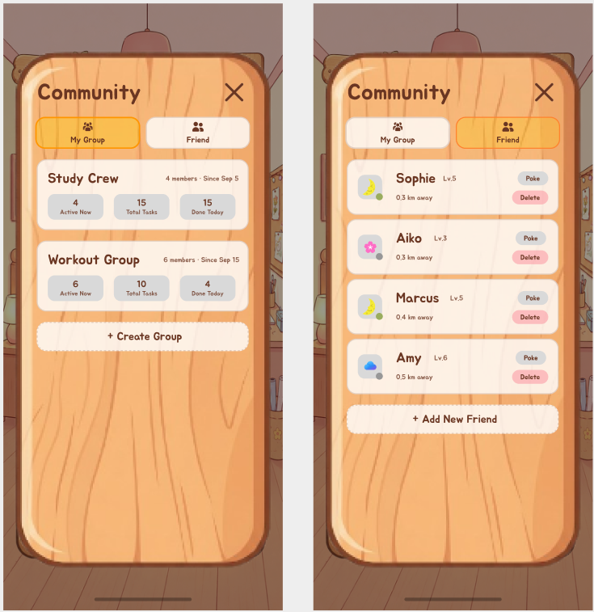

Groups and friends provide a place for encouragement and shared accountability.

## 4. What makes it different

MoshiMoshi connects workload awareness to action and recovery. Its five-dimensional view explains where pressure is building, while task rebalancing offers a change the student can approve. Voice input brings planning and check-ins together, and companion rewards give recovery a place in the same daily loop as academic work.

The proposed context-aware approach also explores whether local activity signals can make suggestions more timely than fixed reminders. This is a technical direction to test, with privacy, permissions, and device constraints shaping what can be delivered.

## 5. Technical architecture and feasibility

### Proposed stack

| Layer | Proposed choice | Rationale and constraints |
| --- | --- | --- |
| Mobile interface | React Native, Android first | Matches the team's experience and keeps the initial platform scope focused. |
| Device signals | Native Android module in Kotlin | Explores permission-based app-usage, screen-on, and calendar signals; manual/calendar input remains a fallback. |
| On-device reasoning | Python/FastAPI in Termux, exploring Gemma 3 1B | Supports an experimental local inference setup; device performance, model suitability, and packaging need validation. |
| Load scoring | Local rule-based Python engine | Gives explainable load estimates; weightings need student-pilot feedback. |
| Optional cloud reasoning | DeepSeek API | Intended for limited check-in summaries; consent, data minimization, and offline fallback are required design work. |
| Voice | ElevenLabs | Proposed spoken companion responses; network dependency and usage cost constrain session length. |
| Community backend | Node.js and Express on Render, MongoDB Atlas | Keeps database credentials off the phone; free-tier capacity and cold starts need evaluation. |
| Local storage | SQLite | Stores tasks and sensitive context locally; cross-device history transfer is outside the initial scope. |

The proposed data flow is permitted local inputs → local storage and load scoring → suggested task changes → student confirmation → recovery and rewards. Optional cloud check-ins and community features are separate from the local loop. The Termux model service is an experimental prototype approach; wider distribution would require a suitable in-app deployment strategy.

### System architecture

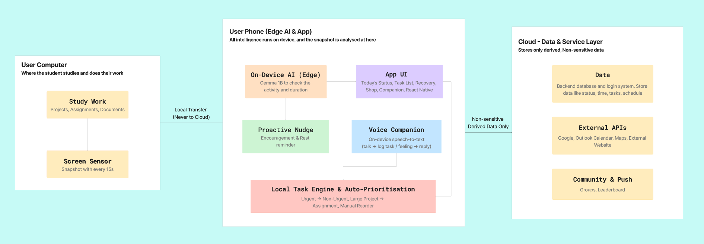

The diagram shows the proposed components and their connections for the planned implementation.

### Build plan and scope

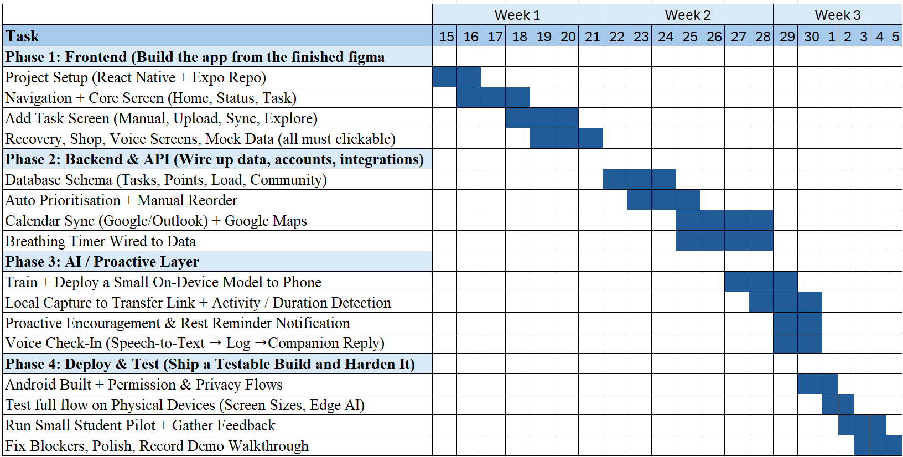

If selected as a finalist, we will focus the Building Phase on the load overview, task rebalancing, guided breathing, and companion rewards.

1. Prepare test cases, recruit students for a small pilot, and validate device permissions and local inference feasibility.
2. Build the core flow from load overview through approved task changes to recovery and rewards.
3. Test on physical Android devices and collect student feedback on clarity, usefulness, and friction.
4. Refine the scoring and interactions, fix issues, and prepare the demonstration.

Broader integrations, location features, and community functions will be prioritized after the core flow is validated. Pilot results will inform any later expansion beyond the initial student group.
